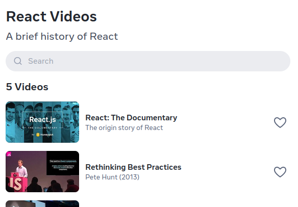

# React-Starter-Challenges

1. Create a Random Color generator. The objective is to have large clickable area that when clicked, generates a random hexadecimal color and updates the ui to display the current color.

2. Make a `Card` component that Shows/Hides content when clicking a button that is part of the card. Also, map through an array of objects to display a list of `Card` components. Replace `Buy` button to `Details` when clocking details we want to see a brief description of the item and it's price.


<details>
  <summary>Topics</summary>

#### JS

  [Random](https://developer.mozilla.org/en-US/docs/Web/JavaScript/Reference/Global_Objects/Math/random) -> [Arrays](https://github.com/Asabeneh/30-Days-Of-JavaScript/blob/master/05_Day_Arrays/05_day_arrays.md)

#### React

  [State](https://react.dev/learn) -> [Event Handlers](https://react.dev/learn/responding-to-events) -> <https://react.dev/learn/conditional-rendering>

</details>

3. Our challenges App is looking a bit dull, we want o beter the UI/UX by creating a `Layout` component. This layout will provide the user with a button that redirects them to `/` to navigate to the rest of the challenges.

<details>
  <summary>Topics</summary>

### React

  How to use children components as props:

  ```JSX
  const Component = ({children}) => (
    <Box>{children}</Box>
  )

  <Component>
    <div>A children component</div>
  </Component>
  ```

### react-router-dom

  [Router](https://reactrouter.com/en/main/routers/create-browser-router) -> [Link](https://reactrouter.com/en/main/components/link) -> [Outlet](https://reactrouter.com/en/main/components/outlet)

</details>

4. Clone the `VideoSearch` component from [React](https://react.dev). We want a video search component that maps through a list of videos and renders them. We also need a searchbar that shows those videos that match the search input. After implementing everything style the component to look jus as React's example.



<details>
  <summary>Topics</summary>

#### JS

  [Arrays](https://github.com/Asabeneh/30-Days-Of-JavaScript/blob/master/05_Day_Arrays/05_day_arrays.md) -> [String](https://developer.mozilla.org/en-US/docs/Web/JavaScript/Reference/Global_Objects/String/includes)

#### React

  [State](https://react.dev/learn) ->
  [Event Handlers](https://react.dev/learn/responding-to-events) ->
  [Update Array State](https://react.dev/learn/updating-arrays-in-state) ->
  [Rendering Lists](https://react.dev/learn/rendering-lists) ->

</details>

5. Our users now want to show their love to the creators. Let's add a like button!

<details>
  <summary>Topics</summary>

#### React

  [State](https://react.dev/learn) ->
  [Event Handlers](https://react.dev/learn/responding-to-events) ->
  [Update Object State](https://react.dev/learn/updating-objects-in-state) ->
  [Conditional Rendering](https://react.dev/learn/conditional-rendering)

</details>

6. Our userbase is growing a lot! We need to start fetching our videos from an API instead off adding them on request.

<details>
  <summary>Topics</summary>

#### React

  [State](https://react.dev/learn) ->
  [useEffect](https://react.dev/learn/responding-to-events) ->
  [React Querry](https://tanstack.com/query/latest/docs/framework/react/guides/queries) ->

</details>

7. Using Props, create a To Do app. Where the user can **Add** and **Delete** To Dos. The main objective is to implement the To Do component with its required props.

<details>
  <summary>Topics</summary>

#### JS

  [Arrays](https://github.com/Asabeneh/30-Days-Of-JavaScript/blob/master/05_Day_Arrays/05_day_arrays.md)

#### React

  [State](https://react.dev/learn) ->
  [Event Handlers](https://react.dev/learn/responding-to-events) ->
  [Update Array State](https://react.dev/learn/updating-arrays-in-state) ->
  [Props](https://react.dev/learn/passing-props-to-a-component) ->
  [Rendering Lists](https://react.dev/learn/rendering-lists)

</details>

8. Now, for our video app we want to have a user profile. Lets add a `UserContext` that holds the users information so we can use it in our `layout` and in a `/user` page.

<details>
  <summary>Topics</summary>

#### React

  [createContext]([https://react.dev/learn](https://react.dev/reference/react/createContext)) ->
  [useContext](https://react.dev/reference/react/useContext)

</details>

## How to start

Clone the repository, head to it's directory and run the following commands:

```bash
npm i
npm run dev
```
